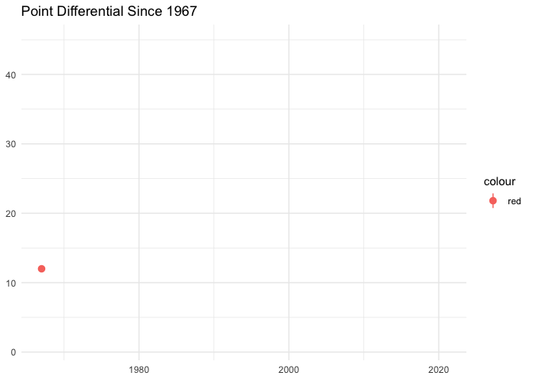

## Question

Testing the old saying, does "defense win championships"? I analyze
Super Bowl performances from 1967-2020, comparing historically great teams
- ones that have won more than two Super Bowls - to teams that have had brief
success. Is having a superior defense the key to sustained Super Bowl
success? If not, what is?

## Data Collection


This [Super Bowl](https://www.kaggle.com/timoboz/superbowl-history-1967-2020) 
data can be credited to Timo Bozsolik, who posted the data on
Kaggle. This data contains Super Bowl data from Super Bowl I in 1967, all the
way until Super Bowl LIV in 2020. It contains data on the winner, loser, points
scored by each team, MVP, and location of the game. I mutate point differential
to the dataset, and quickly add Super Bowl LV data from 2021.

The draft grades data is taken from the following Bleacher Report [article](https://photos.google.com/share/AF1QipNZYJhV7-8_BmZSPBVh1BZ7HX22kdHfXFj8ixDSI-MCVmQrucJdXklE9Thp0cZhYg?key=cF96MWMwNFZvMGhaMTB0VTY4NWwtVkRPMGV5V1F3),
and I have converted the letter grades (A-F) to numeric values 
of 1-13, with 1 being an A+, 2 being an A, all the way to F, which is 13. I also
created a column in the excel file to represent the number of Super Bowl
appearances for each organization from 2003-2021. I chose the given time frame 
for Super Bowl appearances since the Bleacher Report article provides data
from 2003-2012 and drafts have a long-term effect as well. For example, players 
from a draft in 2012 may develop a few years down the road and maximize their 
impact in 2017, although this is a less certain possibility. 

## Analysis
<!-- -->

Super Bowls are generally tight affairs, as shown in the graph below. 
Although there is a large range of point differential, Super Bowls have been
decided by a median point differential of just above 10 points since 1967, as
represented by red dot on the animated plot. Especially as the median point 
differential has decreased since the turn of the century, when games are this 
tight, it makes sense that a superior defense would make this marginal 
difference between losing and winning a championship.

Let's dive in.

```{=html}
<div id="htmlwidget-4c51316faf4f8a66403e" style="width:672px;height:480px;" class="plotly html-widget"></div>
<script type="application/json" data-for="htmlwidget-4c51316faf4f8a66403e">{"x":{"data":[{"x":[1,1,1,1,1,1,1,1,1,1,1,1,1,1,1,1,1,1,1],"y":[13,16,9,10,7,7,7,17,7,10,7,8,14,21,31,33,17,20,9],"hoverinfo":"y","type":"box","fillcolor":"rgba(255,255,255,1)","marker":{"opacity":null,"outliercolor":"rgba(0,0,0,1)","line":{"width":1.88976377952756,"color":"rgba(0,0,0,1)"},"size":5.66929133858268},"line":{"color":"rgba(248,118,109,1)","width":1.88976377952756},"name":"FALSE","legendgroup":"FALSE","showlegend":true,"xaxis":"x","yaxis":"y","frame":null},{"x":[2,2,2,2,2,2,2,2,2,2,2,2,2,2,2,2,2,2,2,2,2,2,2,2,2,2,2,2,2,2,2,2,2,2,2,2],"y":[10,14,21,17,21,3,19,20,6,17,10,10,31,19,13,26,17,10,16,17,19,24,16,10,14,23,17,24,25,29,21,17,24,28,10,3],"hoverinfo":"y","type":"box","fillcolor":"rgba(255,255,255,1)","marker":{"opacity":null,"outliercolor":"rgba(0,0,0,1)","line":{"width":1.88976377952756,"color":"rgba(0,0,0,1)"},"size":5.66929133858268},"line":{"color":"rgba(0,191,196,1)","width":1.88976377952756},"name":"TRUE","legendgroup":"TRUE","showlegend":true,"xaxis":"x","yaxis":"y","frame":null}],"layout":{"margin":{"t":43.7625570776256,"r":7.30593607305936,"b":25.5707762557078,"l":22.648401826484},"font":{"color":"rgba(0,0,0,1)","family":"","size":14.6118721461187},"title":{"text":"Points Allowed","font":{"color":"rgba(0,0,0,1)","family":"","size":17.5342465753425},"x":0,"xref":"paper"},"xaxis":{"domain":[0,1],"automargin":true,"type":"linear","autorange":false,"range":[0.4,2.6],"tickmode":"array","ticktext":["FALSE","TRUE"],"tickvals":[1,2],"categoryorder":"array","categoryarray":["FALSE","TRUE"],"nticks":null,"ticks":"","tickcolor":null,"ticklen":3.65296803652968,"tickwidth":0,"showticklabels":true,"tickfont":{"color":"rgba(77,77,77,1)","family":"","size":11.689497716895},"tickangle":-0,"showline":false,"linecolor":null,"linewidth":0,"showgrid":true,"gridcolor":"rgba(235,235,235,1)","gridwidth":0.66417600664176,"zeroline":false,"anchor":"y","title":{"text":"","font":{"color":null,"family":null,"size":0}},"hoverformat":".2f"},"yaxis":{"domain":[0,1],"automargin":true,"type":"linear","autorange":false,"range":[1.5,34.5],"tickmode":"array","ticktext":["10","20","30"],"tickvals":[10,20,30],"categoryorder":"array","categoryarray":["10","20","30"],"nticks":null,"ticks":"","tickcolor":null,"ticklen":3.65296803652968,"tickwidth":0,"showticklabels":true,"tickfont":{"color":"rgba(77,77,77,1)","family":"","size":11.689497716895},"tickangle":-0,"showline":false,"linecolor":null,"linewidth":0,"showgrid":true,"gridcolor":"rgba(235,235,235,1)","gridwidth":0.66417600664176,"zeroline":false,"anchor":"x","title":{"text":"","font":{"color":null,"family":null,"size":0}},"hoverformat":".2f"},"shapes":[{"type":"rect","fillcolor":null,"line":{"color":null,"width":0,"linetype":[]},"yref":"paper","xref":"paper","x0":0,"x1":1,"y0":0,"y1":1}],"showlegend":true,"legend":{"bgcolor":null,"bordercolor":null,"borderwidth":0,"font":{"color":"rgba(0,0,0,1)","family":"","size":11.689497716895},"y":0.913385826771654},"annotations":[{"text":"sustained","x":1.02,"y":1,"showarrow":false,"ax":0,"ay":0,"font":{"color":"rgba(0,0,0,1)","family":"","size":14.6118721461187},"xref":"paper","yref":"paper","textangle":-0,"xanchor":"left","yanchor":"bottom","legendTitle":true}],"hovermode":"closest","barmode":"relative"},"config":{"doubleClick":"reset","showSendToCloud":false},"source":"A","attrs":{"ed4a35d769ac":{"x":{},"y":{},"colour":{},"type":"box"}},"cur_data":"ed4a35d769ac","visdat":{"ed4a35d769ac":["function (y) ","x"]},"highlight":{"on":"plotly_click","persistent":false,"dynamic":false,"selectize":false,"opacityDim":0.2,"selected":{"opacity":1},"debounce":0},"shinyEvents":["plotly_hover","plotly_click","plotly_selected","plotly_relayout","plotly_brushed","plotly_brushing","plotly_clickannotation","plotly_doubleclick","plotly_deselect","plotly_afterplot","plotly_sunburstclick"],"base_url":"https://plot.ly"},"evals":[],"jsHooks":[]}</script>
```

Sustained, or historically great, winners allow a median of 17 points
in the Super Bowl, while those with limited success allow a median of 10
points. Although historically great teams have a minimum lower points allowed,
it is clear to see that, surprisingly, sustainably great teams don't necessarily 
have superior defenses, at least based on Super Bowl performances. This doesn't
say anything about the importance of defense in the regular season, but winning
more Super Bowls isn't associated with superior defensive performances. 


```{=html}
<div id="htmlwidget-e2c1f5859163925d19c6" style="width:672px;height:480px;" class="plotly html-widget"></div>
<script type="application/json" data-for="htmlwidget-e2c1f5859163925d19c6">{"x":{"data":[{"x":[1,1,1,1,1,1,1,1,1,1,1,1,1,1,1,1,1,1,1],"y":[16,23,38,27,24,16,34,31,14,46,23,43,32,48,34,41,29,31,31],"hoverinfo":"y","type":"box","fillcolor":"rgba(255,255,255,1)","marker":{"opacity":null,"outliercolor":"rgba(0,0,0,1)","line":{"width":1.88976377952756,"color":"rgba(0,0,0,1)"},"size":5.66929133858268},"line":{"color":"rgba(248,118,109,1)","width":1.88976377952756},"name":"FALSE","legendgroup":"FALSE","showlegend":true,"xaxis":"x","yaxis":"y","frame":null},{"x":[2,2,2,2,2,2,2,2,2,2,2,2,2,2,2,2,2,2,2,2,2,2,2,2,2,2,2,2,2,2,2,2,2,2,2,2],"y":[35,33,26,27,35,24,34,39,16,21,55,27,35,31,30,49,27,42,38,21,20,37,20,24,17,27,52,31,31,32,24,20,28,34,21,13],"hoverinfo":"y","type":"box","fillcolor":"rgba(255,255,255,1)","marker":{"opacity":null,"outliercolor":"rgba(0,0,0,1)","line":{"width":1.88976377952756,"color":"rgba(0,0,0,1)"},"size":5.66929133858268},"line":{"color":"rgba(0,191,196,1)","width":1.88976377952756},"name":"TRUE","legendgroup":"TRUE","showlegend":true,"xaxis":"x","yaxis":"y","frame":null}],"layout":{"margin":{"t":43.7625570776256,"r":7.30593607305936,"b":25.5707762557078,"l":22.648401826484},"font":{"color":"rgba(0,0,0,1)","family":"","size":14.6118721461187},"title":{"text":"Points Scored","font":{"color":"rgba(0,0,0,1)","family":"","size":17.5342465753425},"x":0,"xref":"paper"},"xaxis":{"domain":[0,1],"automargin":true,"type":"linear","autorange":false,"range":[0.4,2.6],"tickmode":"array","ticktext":["FALSE","TRUE"],"tickvals":[1,2],"categoryorder":"array","categoryarray":["FALSE","TRUE"],"nticks":null,"ticks":"","tickcolor":null,"ticklen":3.65296803652968,"tickwidth":0,"showticklabels":true,"tickfont":{"color":"rgba(77,77,77,1)","family":"","size":11.689497716895},"tickangle":-0,"showline":false,"linecolor":null,"linewidth":0,"showgrid":true,"gridcolor":"rgba(235,235,235,1)","gridwidth":0.66417600664176,"zeroline":false,"anchor":"y","title":{"text":"","font":{"color":null,"family":null,"size":0}},"hoverformat":".2f"},"yaxis":{"domain":[0,1],"automargin":true,"type":"linear","autorange":false,"range":[10.9,57.1],"tickmode":"array","ticktext":["20","30","40","50"],"tickvals":[20,30,40,50],"categoryorder":"array","categoryarray":["20","30","40","50"],"nticks":null,"ticks":"","tickcolor":null,"ticklen":3.65296803652968,"tickwidth":0,"showticklabels":true,"tickfont":{"color":"rgba(77,77,77,1)","family":"","size":11.689497716895},"tickangle":-0,"showline":false,"linecolor":null,"linewidth":0,"showgrid":true,"gridcolor":"rgba(235,235,235,1)","gridwidth":0.66417600664176,"zeroline":false,"anchor":"x","title":{"text":"","font":{"color":null,"family":null,"size":0}},"hoverformat":".2f"},"shapes":[{"type":"rect","fillcolor":null,"line":{"color":null,"width":0,"linetype":[]},"yref":"paper","xref":"paper","x0":0,"x1":1,"y0":0,"y1":1}],"showlegend":true,"legend":{"bgcolor":null,"bordercolor":null,"borderwidth":0,"font":{"color":"rgba(0,0,0,1)","family":"","size":11.689497716895},"y":0.913385826771654},"annotations":[{"text":"sustained","x":1.02,"y":1,"showarrow":false,"ax":0,"ay":0,"font":{"color":"rgba(0,0,0,1)","family":"","size":14.6118721461187},"xref":"paper","yref":"paper","textangle":-0,"xanchor":"left","yanchor":"bottom","legendTitle":true}],"hovermode":"closest","barmode":"relative"},"config":{"doubleClick":"reset","showSendToCloud":false},"source":"A","attrs":{"ed4a359929d3":{"x":{},"y":{},"colour":{},"type":"box"}},"cur_data":"ed4a359929d3","visdat":{"ed4a359929d3":["function (y) ","x"]},"highlight":{"on":"plotly_click","persistent":false,"dynamic":false,"selectize":false,"opacityDim":0.2,"selected":{"opacity":1},"debounce":0},"shinyEvents":["plotly_hover","plotly_click","plotly_selected","plotly_relayout","plotly_brushed","plotly_brushing","plotly_clickannotation","plotly_doubleclick","plotly_deselect","plotly_afterplot","plotly_sunburstclick"],"base_url":"https://plot.ly"},"evals":[],"jsHooks":[]}</script>
```

Historically great teams score an even lower median of 29 points in the
Super Bowl, compared to a median of 31 points for non-historically great teams.
However, the range for points scored is greater for historically great teams.
It's interesting that the organizations with non-sustained success appear to 
have both offenses and defenses that perform better in the Super Bowl, 
quite contrary to what I initially believed.


```{=html}
<div id="htmlwidget-9a368c0a0f0db167c5e8" style="width:672px;height:480px;" class="plotly html-widget"></div>
<script type="application/json" data-for="htmlwidget-9a368c0a0f0db167c5e8">{"x":{"data":[{"x":[1,1,1,1,1,1,1,1,1,1,1,1,1,1,1,1,1,1,1],"y":[3,7,29,17,17,9,27,14,7,36,16,35,18,27,3,8,12,11,22],"hoverinfo":"y","type":"box","fillcolor":"rgba(255,255,255,1)","marker":{"opacity":null,"outliercolor":"rgba(0,0,0,1)","line":{"width":1.88976377952756,"color":"rgba(0,0,0,1)"},"size":5.66929133858268},"line":{"color":"rgba(248,118,109,1)","width":1.88976377952756},"name":"FALSE","legendgroup":"FALSE","showlegend":true,"xaxis":"x","yaxis":"y","frame":null},{"x":[2,2,2,2,2,2,2,2,2,2,2,2,2,2,2,2,2,2,2,2,2,2,2,2,2,2,2,2,2,2,2,2,2,2,2,2],"y":[25,19,5,10,14,21,15,19,10,4,45,17,4,12,17,23,10,32,22,4,1,13,4,14,3,4,35,7,6,3,3,3,4,6,11,10],"hoverinfo":"y","type":"box","fillcolor":"rgba(255,255,255,1)","marker":{"opacity":null,"outliercolor":"rgba(0,0,0,1)","line":{"width":1.88976377952756,"color":"rgba(0,0,0,1)"},"size":5.66929133858268},"line":{"color":"rgba(0,191,196,1)","width":1.88976377952756},"name":"TRUE","legendgroup":"TRUE","showlegend":true,"xaxis":"x","yaxis":"y","frame":null}],"layout":{"margin":{"t":43.7625570776256,"r":7.30593607305936,"b":25.5707762557078,"l":22.648401826484},"font":{"color":"rgba(0,0,0,1)","family":"","size":14.6118721461187},"title":{"text":"Point Differential","font":{"color":"rgba(0,0,0,1)","family":"","size":17.5342465753425},"x":0,"xref":"paper"},"xaxis":{"domain":[0,1],"automargin":true,"type":"linear","autorange":false,"range":[0.4,2.6],"tickmode":"array","ticktext":["FALSE","TRUE"],"tickvals":[1,2],"categoryorder":"array","categoryarray":["FALSE","TRUE"],"nticks":null,"ticks":"","tickcolor":null,"ticklen":3.65296803652968,"tickwidth":0,"showticklabels":true,"tickfont":{"color":"rgba(77,77,77,1)","family":"","size":11.689497716895},"tickangle":-0,"showline":false,"linecolor":null,"linewidth":0,"showgrid":true,"gridcolor":"rgba(235,235,235,1)","gridwidth":0.66417600664176,"zeroline":false,"anchor":"y","title":{"text":"","font":{"color":null,"family":null,"size":0}},"hoverformat":".2f"},"yaxis":{"domain":[0,1],"automargin":true,"type":"linear","autorange":false,"range":[-1.2,47.2],"tickmode":"array","ticktext":["0","10","20","30","40"],"tickvals":[0,10,20,30,40],"categoryorder":"array","categoryarray":["0","10","20","30","40"],"nticks":null,"ticks":"","tickcolor":null,"ticklen":3.65296803652968,"tickwidth":0,"showticklabels":true,"tickfont":{"color":"rgba(77,77,77,1)","family":"","size":11.689497716895},"tickangle":-0,"showline":false,"linecolor":null,"linewidth":0,"showgrid":true,"gridcolor":"rgba(235,235,235,1)","gridwidth":0.66417600664176,"zeroline":false,"anchor":"x","title":{"text":"","font":{"color":null,"family":null,"size":0}},"hoverformat":".2f"},"shapes":[{"type":"rect","fillcolor":null,"line":{"color":null,"width":0,"linetype":[]},"yref":"paper","xref":"paper","x0":0,"x1":1,"y0":0,"y1":1}],"showlegend":true,"legend":{"bgcolor":null,"bordercolor":null,"borderwidth":0,"font":{"color":"rgba(0,0,0,1)","family":"","size":11.689497716895},"y":0.913385826771654},"annotations":[{"text":"sustained","x":1.02,"y":1,"showarrow":false,"ax":0,"ay":0,"font":{"color":"rgba(0,0,0,1)","family":"","size":14.6118721461187},"xref":"paper","yref":"paper","textangle":-0,"xanchor":"left","yanchor":"bottom","legendTitle":true}],"hovermode":"closest","barmode":"relative"},"config":{"doubleClick":"reset","showSendToCloud":false},"source":"A","attrs":{"ed4a71daf73e":{"x":{},"y":{},"colour":{},"type":"box"}},"cur_data":"ed4a71daf73e","visdat":{"ed4a71daf73e":["function (y) ","x"]},"highlight":{"on":"plotly_click","persistent":false,"dynamic":false,"selectize":false,"opacityDim":0.2,"selected":{"opacity":1},"debounce":0},"shinyEvents":["plotly_hover","plotly_click","plotly_selected","plotly_relayout","plotly_brushed","plotly_brushing","plotly_clickannotation","plotly_doubleclick","plotly_deselect","plotly_afterplot","plotly_sunburstclick"],"base_url":"https://plot.ly"},"evals":[],"jsHooks":[]}</script>
```
The aforementioned notion is validated by this graph, with historically great
organizations playing in closer Super Bowls, as the median point differential
is 10 points. This is much less than the median point differential of 16 points
for organizations with non-sustained success. Although the difference between
the two median point differentials may appear marginal, 6 points is the 
equivalent of one touchdown. This means that those with non-sustained success
win Super Bowls by a median differential of almost 3 scores, compared to a much
tighter 2-score differential for sustainable winners.

Why is this the case? Let's examine the figure above, which depicts the 
relationship between Super Bowl appearances from 2003-2021 and Draft Grades 
for teams between 2003-2012. 


```{=html}
<div id="htmlwidget-31e8e51d7bed4f080c96" style="width:672px;height:480px;" class="plotly html-widget"></div>
<script type="application/json" data-for="htmlwidget-31e8e51d7bed4f080c96">{"x":{"data":[{"orientation":"v","width":0.9,"base":6,"x":[7],"y":[1],"text":"Draft_Ranking:  7<br />Super_Bowl_Appearances: 1<br />Team: Arizona Cardinals","type":"bar","marker":{"autocolorscale":false,"color":"rgba(68,1,84,1)","line":{"width":1.88976377952756,"color":"transparent"}},"name":"Arizona Cardinals","legendgroup":"Arizona Cardinals","showlegend":true,"xaxis":"x","yaxis":"y","hoverinfo":"text","frame":null},{"orientation":"v","width":0.9,"base":8,"x":[2],"y":[1],"text":"Draft_Ranking:  2<br />Super_Bowl_Appearances: 1<br />Team: Atlanta Falcons","type":"bar","marker":{"autocolorscale":false,"color":"rgba(71,14,97,1)","line":{"width":1.88976377952756,"color":"transparent"}},"name":"Atlanta Falcons","legendgroup":"Atlanta Falcons","showlegend":true,"xaxis":"x","yaxis":"y","hoverinfo":"text","frame":null},{"orientation":"v","width":0.9,"base":5,"x":[3],"y":[1],"text":"Draft_Ranking:  3<br />Super_Bowl_Appearances: 1<br />Team: Baltimore Ravens","type":"bar","marker":{"autocolorscale":false,"color":"rgba(72,27,109,1)","line":{"width":1.88976377952756,"color":"transparent"}},"name":"Baltimore Ravens","legendgroup":"Baltimore Ravens","showlegend":true,"xaxis":"x","yaxis":"y","hoverinfo":"text","frame":null},{"orientation":"v","width":null,"base":0,"x":[null],"y":[0],"text":"Draft_Ranking: 10<br />Super_Bowl_Appearances: 0<br />Team: Buffalo Bills","type":"bar","marker":{"autocolorscale":false,"color":"rgba(72,39,119,1)","line":{"width":1.88976377952756,"color":"transparent"}},"name":"Buffalo Bills","legendgroup":"Buffalo Bills","showlegend":true,"xaxis":"x","yaxis":"y","hoverinfo":"text","frame":null},{"orientation":"v","width":0.9,"base":4,"x":[7],"y":[2],"text":"Draft_Ranking:  7<br />Super_Bowl_Appearances: 2<br />Team: Carolina Panthers","type":"bar","marker":{"autocolorscale":false,"color":"rgba(70,51,126,1)","line":{"width":1.88976377952756,"color":"transparent"}},"name":"Carolina Panthers","legendgroup":"Carolina Panthers","showlegend":true,"xaxis":"x","yaxis":"y","hoverinfo":"text","frame":null},{"orientation":"v","width":0.9,"base":0,"x":[5],"y":[1],"text":"Draft_Ranking:  5<br />Super_Bowl_Appearances: 1<br />Team: Chicago Bears","type":"bar","marker":{"autocolorscale":false,"color":"rgba(67,62,133,1)","line":{"width":1.88976377952756,"color":"transparent"}},"name":"Chicago Bears","legendgroup":"Chicago Bears","showlegend":true,"xaxis":"x","yaxis":"y","hoverinfo":"text","frame":null},{"orientation":"v","width":0.9,"base":0,"x":[4],"y":[0],"text":"Draft_Ranking:  4<br />Super_Bowl_Appearances: 0<br />Team: Cincinnati Bengals","type":"bar","marker":{"autocolorscale":false,"color":"rgba(63,72,137,1)","line":{"width":1.88976377952756,"color":"transparent"}},"name":"Cincinnati Bengals","legendgroup":"Cincinnati Bengals","showlegend":true,"xaxis":"x","yaxis":"y","hoverinfo":"text","frame":null},{"orientation":"v","width":0.899999999999999,"base":0,"x":[9],"y":[0],"text":"Draft_Ranking:  9<br />Super_Bowl_Appearances: 0<br />Team: Cleveland Browns","type":"bar","marker":{"autocolorscale":false,"color":"rgba(59,82,139,1)","line":{"width":1.88976377952756,"color":"transparent"}},"name":"Cleveland Browns","legendgroup":"Cleveland Browns","showlegend":true,"xaxis":"x","yaxis":"y","hoverinfo":"text","frame":null},{"orientation":"v","width":0.9,"base":0,"x":[5],"y":[0],"text":"Draft_Ranking:  5<br />Super_Bowl_Appearances: 0<br />Team: Dallas Cowboys","type":"bar","marker":{"autocolorscale":false,"color":"rgba(54,92,141,1)","line":{"width":1.88976377952756,"color":"transparent"}},"name":"Dallas Cowboys","legendgroup":"Dallas Cowboys","showlegend":true,"xaxis":"x","yaxis":"y","hoverinfo":"text","frame":null},{"orientation":"v","width":0.9,"base":2,"x":[7],"y":[2],"text":"Draft_Ranking:  7<br />Super_Bowl_Appearances: 2<br />Team: Denver Broncos","type":"bar","marker":{"autocolorscale":false,"color":"rgba(50,101,142,1)","line":{"width":1.88976377952756,"color":"transparent"}},"name":"Denver Broncos","legendgroup":"Denver Broncos","showlegend":true,"xaxis":"x","yaxis":"y","hoverinfo":"text","frame":null},{"orientation":"v","width":null,"base":0,"x":[null],"y":[0],"text":"Draft_Ranking: 10<br />Super_Bowl_Appearances: 0<br />Team: Detroit Lions","type":"bar","marker":{"autocolorscale":false,"color":"rgba(46,110,142,1)","line":{"width":1.88976377952756,"color":"transparent"}},"name":"Detroit Lions","legendgroup":"Detroit Lions","showlegend":true,"xaxis":"x","yaxis":"y","hoverinfo":"text","frame":null},{"orientation":"v","width":0.9,"base":4,"x":[3],"y":[1],"text":"Draft_Ranking:  3<br />Super_Bowl_Appearances: 1<br />Team: Green Bay Packers","type":"bar","marker":{"autocolorscale":false,"color":"rgba(42,118,142,1)","line":{"width":1.88976377952756,"color":"transparent"}},"name":"Green Bay Packers","legendgroup":"Green Bay Packers","showlegend":true,"xaxis":"x","yaxis":"y","hoverinfo":"text","frame":null},{"orientation":"v","width":0.9,"base":0,"x":[5],"y":[0],"text":"Draft_Ranking:  5<br />Super_Bowl_Appearances: 0<br />Team: Houston Texans","type":"bar","marker":{"autocolorscale":false,"color":"rgba(39,127,142,1)","line":{"width":1.88976377952756,"color":"transparent"}},"name":"Houston Texans","legendgroup":"Houston Texans","showlegend":true,"xaxis":"x","yaxis":"y","hoverinfo":"text","frame":null},{"orientation":"v","width":0.899999999999999,"base":5,"x":[8],"y":[2],"text":"Draft_Ranking:  8<br />Super_Bowl_Appearances: 2<br />Team: Indianapolis Colts","type":"bar","marker":{"autocolorscale":false,"color":"rgba(36,135,142,1)","line":{"width":1.88976377952756,"color":"transparent"}},"name":"Indianapolis Colts","legendgroup":"Indianapolis Colts","showlegend":true,"xaxis":"x","yaxis":"y","hoverinfo":"text","frame":null},{"orientation":"v","width":0.9,"base":0,"x":[7],"y":[2],"text":"Draft_Ranking:  7<br />Super_Bowl_Appearances: 2<br />Team: Kansas City Chiefs","type":"bar","marker":{"autocolorscale":false,"color":"rgba(33,144,140,1)","line":{"width":1.88976377952756,"color":"transparent"}},"name":"Kansas City Chiefs","legendgroup":"Kansas City Chiefs","showlegend":true,"xaxis":"x","yaxis":"y","hoverinfo":"text","frame":null},{"orientation":"v","width":0.899999999999999,"base":5,"x":[8],"y":[0],"text":"Draft_Ranking:  8<br />Super_Bowl_Appearances: 0<br />Team: Miami Dolphins","type":"bar","marker":{"autocolorscale":false,"color":"rgba(31,153,138,1)","line":{"width":1.88976377952756,"color":"transparent"}},"name":"Miami Dolphins","legendgroup":"Miami Dolphins","showlegend":true,"xaxis":"x","yaxis":"y","hoverinfo":"text","frame":null},{"orientation":"v","width":0.9,"base":0,"x":[7],"y":[0],"text":"Draft_Ranking:  7<br />Super_Bowl_Appearances: 0<br />Team: Minnesota Vikings","type":"bar","marker":{"autocolorscale":false,"color":"rgba(31,161,135,1)","line":{"width":1.88976377952756,"color":"transparent"}},"name":"Minnesota Vikings","legendgroup":"Minnesota Vikings","showlegend":true,"xaxis":"x","yaxis":"y","hoverinfo":"text","frame":null},{"orientation":"v","width":0.9,"base":0,"x":[2],"y":[8],"text":"Draft_Ranking:  2<br />Super_Bowl_Appearances: 8<br />Team: New England Patriots","type":"bar","marker":{"autocolorscale":false,"color":"rgba(36,170,131,1)","line":{"width":1.88976377952756,"color":"transparent"}},"name":"New England Patriots","legendgroup":"New England Patriots","showlegend":true,"xaxis":"x","yaxis":"y","hoverinfo":"text","frame":null},{"orientation":"v","width":0.899999999999999,"base":4,"x":[8],"y":[1],"text":"Draft_Ranking:  8<br />Super_Bowl_Appearances: 1<br />Team: New Orleans Saints","type":"bar","marker":{"autocolorscale":false,"color":"rgba(45,178,125,1)","line":{"width":1.88976377952756,"color":"transparent"}},"name":"New Orleans Saints","legendgroup":"New Orleans Saints","showlegend":true,"xaxis":"x","yaxis":"y","hoverinfo":"text","frame":null},{"orientation":"v","width":0.9,"base":2,"x":[3],"y":[2],"text":"Draft_Ranking:  3<br />Super_Bowl_Appearances: 2<br />Team: New York Giants","type":"bar","marker":{"autocolorscale":false,"color":"rgba(58,186,118,1)","line":{"width":1.88976377952756,"color":"transparent"}},"name":"New York Giants","legendgroup":"New York Giants","showlegend":true,"xaxis":"x","yaxis":"y","hoverinfo":"text","frame":null},{"orientation":"v","width":0.899999999999999,"base":2,"x":[8],"y":[2],"text":"Draft_Ranking:  8<br />Super_Bowl_Appearances: 2<br />Team: Philadelphia Eagles","type":"bar","marker":{"autocolorscale":false,"color":"rgba(74,193,109,1)","line":{"width":1.88976377952756,"color":"transparent"}},"name":"Philadelphia Eagles","legendgroup":"Philadelphia Eagles","showlegend":true,"xaxis":"x","yaxis":"y","hoverinfo":"text","frame":null},{"orientation":"v","width":0.9,"base":0,"x":[1],"y":[3],"text":"Draft_Ranking:  1<br />Super_Bowl_Appearances: 3<br />Team: Pittsburgh Steelers","type":"bar","marker":{"autocolorscale":false,"color":"rgba(93,200,99,1)","line":{"width":1.88976377952756,"color":"transparent"}},"name":"Pittsburgh Steelers","legendgroup":"Pittsburgh Steelers","showlegend":true,"xaxis":"x","yaxis":"y","hoverinfo":"text","frame":null},{"orientation":"v","width":0.9,"base":0,"x":[7],"y":[0],"text":"Draft_Ranking:  7<br />Super_Bowl_Appearances: 0<br />Team: San Diego Chargers","type":"bar","marker":{"autocolorscale":false,"color":"rgba(113,207,87,1)","line":{"width":1.88976377952756,"color":"transparent"}},"name":"San Diego Chargers","legendgroup":"San Diego Chargers","showlegend":true,"xaxis":"x","yaxis":"y","hoverinfo":"text","frame":null},{"orientation":"v","width":0.9,"base":0,"x":[3],"y":[2],"text":"Draft_Ranking:  3<br />Super_Bowl_Appearances: 2<br />Team: San Francisco 49ers","type":"bar","marker":{"autocolorscale":false,"color":"rgba(135,213,73,1)","line":{"width":1.88976377952756,"color":"transparent"}},"name":"San Francisco 49ers","legendgroup":"San Francisco 49ers","showlegend":true,"xaxis":"x","yaxis":"y","hoverinfo":"text","frame":null},{"orientation":"v","width":0.9,"base":0,"x":[6],"y":[3],"text":"Draft_Ranking:  6<br />Super_Bowl_Appearances: 3<br />Team: Seattle Seahawks","type":"bar","marker":{"autocolorscale":false,"color":"rgba(159,218,58,1)","line":{"width":1.88976377952756,"color":"transparent"}},"name":"Seattle Seahawks","legendgroup":"Seattle Seahawks","showlegend":true,"xaxis":"x","yaxis":"y","hoverinfo":"text","frame":null},{"orientation":"v","width":0.899999999999999,"base":1,"x":[8],"y":[1],"text":"Draft_Ranking:  8<br />Super_Bowl_Appearances: 1<br />Team: St. Louis/LA Rams","type":"bar","marker":{"autocolorscale":false,"color":"rgba(183,222,42,1)","line":{"width":1.88976377952756,"color":"transparent"}},"name":"St. Louis/LA Rams","legendgroup":"St. Louis/LA Rams","showlegend":true,"xaxis":"x","yaxis":"y","hoverinfo":"text","frame":null},{"orientation":"v","width":0.899999999999999,"base":0,"x":[8],"y":[1],"text":"Draft_Ranking:  8<br />Super_Bowl_Appearances: 1<br />Team: Tampa Bay Buccaneers","type":"bar","marker":{"autocolorscale":false,"color":"rgba(207,225,28,1)","line":{"width":1.88976377952756,"color":"transparent"}},"name":"Tampa Bay Buccaneers","legendgroup":"Tampa Bay Buccaneers","showlegend":true,"xaxis":"x","yaxis":"y","hoverinfo":"text","frame":null},{"orientation":"v","width":null,"base":0,"x":[null],"y":[0],"text":"Draft_Ranking: 10<br />Super_Bowl_Appearances: 0<br />Team: Tennessee Titans","type":"bar","marker":{"autocolorscale":false,"color":"rgba(231,228,25,1)","line":{"width":1.88976377952756,"color":"transparent"}},"name":"Tennessee Titans","legendgroup":"Tennessee Titans","showlegend":true,"xaxis":"x","yaxis":"y","hoverinfo":"text","frame":null},{"orientation":"v","width":0.9,"base":0,"x":[7],"y":[0],"text":"Draft_Ranking:  7<br />Super_Bowl_Appearances: 0<br />Team: Washington Redskins","type":"bar","marker":{"autocolorscale":false,"color":"rgba(253,231,37,1)","line":{"width":1.88976377952756,"color":"transparent"}},"name":"Washington Redskins","legendgroup":"Washington Redskins","showlegend":true,"xaxis":"x","yaxis":"y","hoverinfo":"text","frame":null}],"layout":{"margin":{"t":43.7625570776256,"r":7.30593607305936,"b":25.5707762557078,"l":28.4931506849315},"font":{"color":"rgba(0,0,0,1)","family":"","size":14.6118721461187},"title":{"text":"2003-2021 Super Bowl Appearances vs Draft Grade","font":{"color":"rgba(0,0,0,1)","family":"","size":17.5342465753425},"x":0,"xref":"paper"},"xaxis":{"domain":[0,1],"automargin":true,"type":"linear","autorange":false,"range":[-0.5,10.5],"tickmode":"array","ticktext":["0.0","2.5","5.0","7.5","10.0"],"tickvals":[0,2.5,5,7.5,10],"categoryorder":"array","categoryarray":["0.0","2.5","5.0","7.5","10.0"],"nticks":null,"ticks":"","tickcolor":null,"ticklen":3.65296803652968,"tickwidth":0,"showticklabels":true,"tickfont":{"color":"rgba(77,77,77,1)","family":"","size":11.689497716895},"tickangle":-0,"showline":false,"linecolor":null,"linewidth":0,"showgrid":true,"gridcolor":"rgba(235,235,235,1)","gridwidth":0.66417600664176,"zeroline":false,"anchor":"y","title":{"text":"","font":{"color":null,"family":null,"size":0}},"hoverformat":".2f"},"yaxis":{"domain":[0,1],"automargin":true,"type":"linear","autorange":false,"range":[-0.45,9.45],"tickmode":"array","ticktext":["0.0","2.5","5.0","7.5"],"tickvals":[0,2.5,5,7.5],"categoryorder":"array","categoryarray":["0.0","2.5","5.0","7.5"],"nticks":null,"ticks":"","tickcolor":null,"ticklen":3.65296803652968,"tickwidth":0,"showticklabels":true,"tickfont":{"color":"rgba(77,77,77,1)","family":"","size":11.689497716895},"tickangle":-0,"showline":false,"linecolor":null,"linewidth":0,"showgrid":true,"gridcolor":"rgba(235,235,235,1)","gridwidth":0.66417600664176,"zeroline":false,"anchor":"x","title":{"text":"","font":{"color":null,"family":null,"size":0}},"hoverformat":".2f"},"shapes":[{"type":"rect","fillcolor":null,"line":{"color":null,"width":0,"linetype":[]},"yref":"paper","xref":"paper","x0":0,"x1":1,"y0":0,"y1":1}],"showlegend":true,"legend":{"bgcolor":null,"bordercolor":null,"borderwidth":0,"font":{"color":"rgba(0,0,0,1)","family":"","size":11.689497716895},"y":0.913385826771654},"annotations":[{"text":"Team","x":1.02,"y":1,"showarrow":false,"ax":0,"ay":0,"font":{"color":"rgba(0,0,0,1)","family":"","size":14.6118721461187},"xref":"paper","yref":"paper","textangle":-0,"xanchor":"left","yanchor":"bottom","legendTitle":true}],"hovermode":"closest","barmode":"relative"},"config":{"doubleClick":"reset","showSendToCloud":false},"source":"A","attrs":{"ed4a91baa8":{"x":{},"y":{},"fill":{},"type":"bar"}},"cur_data":"ed4a91baa8","visdat":{"ed4a91baa8":["function (y) ","x"]},"highlight":{"on":"plotly_click","persistent":false,"dynamic":false,"selectize":false,"opacityDim":0.2,"selected":{"opacity":1},"debounce":0},"shinyEvents":["plotly_hover","plotly_click","plotly_selected","plotly_relayout","plotly_brushed","plotly_brushing","plotly_clickannotation","plotly_doubleclick","plotly_deselect","plotly_afterplot","plotly_sunburstclick"],"base_url":"https://plot.ly"},"evals":[],"jsHooks":[]}</script>
```

My findings so far lead me to hypothesize that organizations with brief success 
go all out for those 1 or 2 particular years, occasionally capitalizing on
high draft picks and free agency signings. However, their lack of sustained 
success may come down to a lack of long-term planning, such as a steady stream
of poor drafts and free agency signings that don't provide any long-term 
benefit. They may get things right for a season or two, but for the most 
part, they fail.

This largely holds true based on the figure above, as organizations like the 
New England Patriots, Pittsburgh Steelers, and Seattle Seahawks, which have had
more than two Super Bowl appearances since 2003, have grades of A, A+, and B-,
respectively. While there are teams like the Cowboys and Texans that have B 
grades but haven't made the Super Bowl, only teams with a C draft grade or 
higher have made the Super Bowl since 2003. Furthermore, teams like the Packers 
and Ravens, which have had only one appearance since 2003 but have high draft 
grades, enjoy plenty of playoff appearances and success without making 
the championship. There definitely is a relationship between quality of draft 
picks and long-term success.

## Conclusion

The NFL is full of talent, but talent can come and go in the league, either due
to money, injury, or retirement. In order to create sustained success, 
organizations need to effectively plan for the future, either through
management, free agency transactions, or draft picks. 

